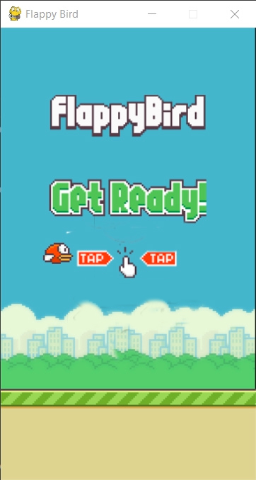

# Flappy Bird Game.
  

<h2>Demo<h2>

 

<h2> Download and Installation</h2>
<ul>
<li> Clone the repository</li>
<pre>git clone https://github.com/deepanshug4/Python-Projects </pre>
<li>Create virtual environment and activate it</li>
<pre>
virtualenv venv
</pre>
<li>Activate the virtualenv</li>
<pre>
cd venv/Scripts 
activate
cd ../../
</pre>
<li>Install all dependencies</li>
<pre>
pip install -r requirements.txt
</pre>
</ul>

> ## `audio`
>> This folder contains all the music assets used in the project.  

> ## `sprites`
>>This folder contains all the animated assets used in the project.

---
